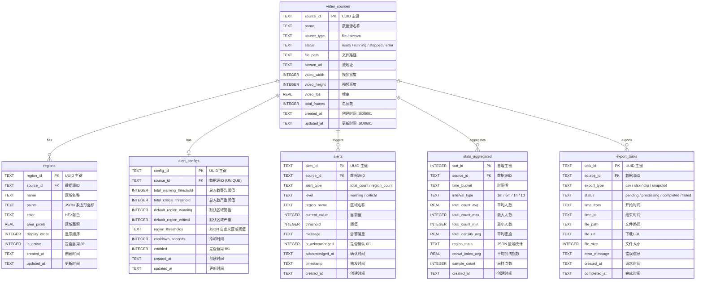

## 主要功能

- **多格式输入**：支持视频文件上传和摄像头实时传入
- **实时人数统计**：基于 YOLO 检测，实时显示画面中的总人数
- **区域密度分析**：用户可自定义划分区域（如前/中/后区），分别统计各区域人数与密度
- **密度热力图**：以热力图形式可视化人流密度分布，直观展示拥挤区域
- **高密度预警**：当区域密度超过设定阈值时，自动触发预警提示
- **历史数据查询**：记录历史人流数据，支持按时间段查询与趋势分析
- **数据导出**：支持将统计数据导出为 CSV/Excel 格式

---

## 接口设计

### 通用约定

- **基础路径**：`/api`
- **WebSocket 路径**：`/api/ws`
- **数据格式**：JSON（文件上传为 `multipart/form-data`）
- **字段命名**：`snake_case`
- **统一响应格式**：
  ```json
  {
    "code": 0,
    "data": { ... },
    "msg": "success"
  }
  ```
  - `code`: 0 成功，非 0 失败
  - `data`: 业务数据
  - `msg`: 提示信息

---

### 1. 数据源管理

| 方法 | 路径 | 说明 |
|------|------|------|
| POST | `/api/sources/upload` | 上传视频文件 |
| POST | `/api/sources/stream` | 接入摄像头/推流 |
| GET | `/api/sources` | 获取数据源列表 |
| DELETE | `/api/sources/:source_id` | 删除数据源 |

#### POST /api/sources/upload
上传视频文件

- **请求**：`multipart/form-data`
  - `file`: 视频文件
- **响应**：
  ```json
  { "source_id": "uuid", "name": "video.mp4", "source_type": "file" }
  ```

#### POST /api/sources/stream
接入摄像头/推流地址

- **请求**：
  ```json
  { "url": "rtsp://...", "name": "摄像头1" }
  ```
- **响应**：
  ```json
  { "source_id": "uuid", "name": "摄像头1", "source_type": "stream" }
  ```

#### GET /api/sources
获取数据源列表

- **响应**：
  ```json
  {
    "sources": [
      { "source_id": "uuid", "name": "video.mp4", "source_type": "file", "status": "ready", "created_at": "2025-01-19T10:00:00Z" }
    ]
  }
  ```

---

### 2. 分析控制

| 方法 | 路径 | 说明 |
|------|------|------|
| POST | `/api/analysis/start` | 开始分析 |
| POST | `/api/analysis/stop` | 停止分析 |
| GET | `/api/analysis/status` | 查询分析状态 |

#### POST /api/analysis/start
开始分析

- **请求**：
  ```json
  {
    "source_id": "uuid",
  }
  ```
- **响应**：
  ```json
  { "source_id": "uuid", "status": "running" }
  ```

#### POST /api/analysis/stop
停止分析

- **请求**：
  ```json
  { "source_id": "uuid" }
  ```
- **响应**：
  ```json
  { "ok": true }
  ```

#### GET /api/analysis/status?source_id=...
查询分析状态

- **响应**：
  ```json
  {
    "source_id": "uuid",
    "status": "running",
    "start_time": "2025-01-19T10:00:00Z",
  }
  ```

---

### 3. 实时推送（WebSocket）

| 路径 | 说明 |
|------|------|
| `/api/ws/realtime?source_id=...` | 实时推理数据推送 |
| `/api/ws/alerts?source_id=...` | 预警消息推送 |

#### WS /api/ws/realtime
实时推理数据推送（视频帧已叠加热力图）

- **消息格式**：
  ```json
  {
    "ts": "2025-01-19T10:00:00.123Z",
    "frame": "base64...",
    "total_count": 150,
    "total_density": 0.005,
    "regions": [
      "regionid": {
        "total_count_avg": 50,
        "total_count_max": 65,
        "total_count_min": 40,
        "total_density_avg": 0.004,
        "crowd_index_avg": 0.8
      }    
    ],
    "crowd_index": 0.75,
    "entry_speed": 12
  }
  ```

#### WS /api/ws/alerts
预警消息推送

- **消息格式**：
  ```json
  {
    "alert_id": "uuid",
    "alert_type": "region_count",
    "level": "critical",
    "regionId": "xxxx",
    "region_name": "前区",
    "current_value": 65,
    "threshold": 50,
    "timestamp": "2025-01-19T10:00:00Z",
    "message": "前区人数超过阈值"
  }
  ```

---

### 4. 预警配置

| 方法 | 路径 | 说明 |
|------|------|------|
| GET | `/api/alerts/recent` | 获取最近五次预警 |
| GET | `/api/alerts/export` | 导出告警记录 |
| GET | `/api/alerts/threshold` | 获取当前阈值配置 |
| POST | `/api/alerts/threshold` | 更新阈值配置 |

#### GET /api/alerts/recent?source_id=...
获取最近五次预警

- **响应**：
  ```json
  {
    "items": [
      {
        "alert_id": "uuid",
        "alert_type": "region_count",
        "level": "critical",
        "region_name": "前区",
        "current_value": 65,
        "threshold": 50,
        "timestamp": "2025-01-19T10:00:00Z",
        "message": "前区人数超过阈值"
      }
    ]
  }
  ```

#### GET /api/alerts/threshold?source_id=...
获取当前阈值配置

- **响应**：
  ```json
  {
    "total_warning_threshold": 50,
    "total_critical_threshold": 100,
    "default_region_warning": 20,
    "default_region_critical": 50,
    "region_thresholds": {
      "regionid" : {"name" :"前区", "warning": 20, "critical": 40 }
    },
    "cooldown_seconds": 30
  }
  ```

#### POST /api/alerts/threshold
更新阈值配置

- **请求**：
  ```json
  {
    "source_id": "uuid",
    "total_warning_threshold": 60,
    "total_critical_threshold": 120,
    "region_thresholds": {
       "regionid" : {"name" :"前区", "warning": 20, "critical": 40 }
    }
  }
  ```
- **响应**：
  ```json
  { "ok": true }
  ```

#### GET /api/alerts/export?source_id=...&from=...&to=...&format=csv|xlsx
导出告警记录

- **响应**：
  ```json
  { "url": "/downloads/alerts_20250119.csv" }
  ```

---

### 5. 区域配置

| 方法 | 路径 | 说明 |
|------|------|------|
| GET | `/api/regions` | 获取区域列表 |
| POST | `/api/regions` | 创建区域 |
| PUT | `/api/regions/:region_id` | 更新区域 |
| DELETE | `/api/regions/:region_id` | 删除区域 |

#### GET /api/regions?source_id=...
获取区域列表

- **响应**：
  ```json
  {
    "regions": [
      { "region_id": "uuid", "name": "前区", "points": [[0,0], [100,0], [100,100], [0,100]], "color": "#FF5733" }
    ]
  }
  ```

#### POST /api/regions
创建区域

- **请求**：
  ```json
  {
    "source_id": "uuid",
    "name": "前区",
    "points": [[0,0], [100,0], [100,100], [0,100]],
    "color": "#FF5733"
  }
  ```
- **响应**：
  ```json
  { "region_id": "uuid", "name": "前区" }
  ```

---

### 6. 历史与导出

| 方法 | 路径 | 说明 |
|------|------|------|
| GET | `/api/history` | 历史趋势查询 |
| GET | `/api/export` | 导出统计数据 |
| POST | `/api/clip/export` | 导出视频片段（暂不实现） |
| POST | `/api/frame/snapshot` | 截图保存(暂不实现) |

#### GET /api/history?source_id=...&from=...&to=...&interval=...
历史趋势查询

- **参数**：
  - `source_id`: 数据源 ID
  - `from`: 开始时间（ISO 8601）
  - `to`: 结束时间（ISO 8601）
  - `interval`: 聚合间隔（1m / 5m / 1h）
- **说明**：
  - `series` 为趋势图数据，按时间桶返回各指标
- **响应**：
  ```json
  {
    "series": [
      {
        "time": "2025-01-19T10:00:00Z",
        "total_count_avg": 120,
        "total_count_max": 140,
        "total_count_min": 98,
        "total_density_avg": 0.005,
        "crowd_index_avg": 0.72,
        "regions": {
          "regionid": {
            "total_count_avg": 50,
            "total_count_max": 65,
            "total_count_min": 40,
            "total_density_avg": 0.004,
            "crowd_index_avg": 0.8
          }
        }
      }
    ]
  }
  ```

#### GET /api/export?source_id=...&from=...&to=...&format=csv|xlsx
导出统计数据

- **响应**：
  ```json
  { "url": "/downloads/export_20250119.csv" }
  ```

#### POST /api/clip/export(暂不实现)
导出视频片段

- **请求**：
  ```json
  {
    "source_id": "uuid",
    "from": "2025-01-19T10:00:00Z",
    "to": "2025-01-19T10:05:00Z"
  }
  ```
- **响应**：
  ```json
  { "url": "/downloads/clip_20250119.mp4" }
  ```

#### POST /api/frame/snapshot(暂不实现)
截图保存

- **请求**：
  ```json
  { "source_id": "uuid" }
  ```
- **响应**：
  ```json
  { "url": "/downloads/snapshot_20250119.jpg" }
  ```

---

### 7. 系统状态

| 方法 | 路径 | 说明 |
|------|------|------|
| GET | `/api/status` | 获取系统运行状态 |

#### GET /api/status
获取系统运行状态

- **响应**：
  ```json
  {
    "status": "running",
    "uptime": 3600,
    "active_sources": 1,
    "gpu_usage": 0.45,
    "cpu_usage": 0.30
  }
  ```

---

## 数据库设计

### ER 关系图



**核心关系说明**：
- `video_sources` 是核心实体，所有业务数据都通过 `source_id` 关联
- `regions` 存储用户自定义的检测区域，与数据源绑定（1:N）
- `alert_configs` 存储每个数据源的预警阈值配置（1:1）
- `alerts` 记录历史告警（1:N）
- `stats_aggregated` 存储按时间粒度聚合后的统计数据（1:N）
- `export_tasks` 记录数据导出任务及其状态（1:N）

> **SQLite 类型说明**：SQLite 使用动态类型，`TEXT`/`INTEGER`/`REAL` 为亲和类型。布尔值用 `INTEGER`（0/1）表示，日期时间用 `TEXT`（ISO 8601 格式）存储。

---

### 1. video_sources - 数据源表

存储视频文件和摄像头流的元数据信息。

| 字段名 | 类型 | 约束 | 说明 |
|--------|------|------|------|
| source_id | TEXT | PRIMARY KEY | UUID，数据源唯一标识 |
| name | TEXT | NOT NULL | 数据源名称（文件名或摄像头名） |
| source_type | TEXT | NOT NULL | 类型：`file` / `stream` |
| status | TEXT | NOT NULL, DEFAULT 'ready' | 状态：`ready` / `running` / `stopped` / `error` |
| file_path | TEXT | NULL | 文件存储路径（仅 file 类型） |
| stream_url | TEXT | NULL | 流地址（仅 stream 类型） |
| video_width | INTEGER | NULL | 视频宽度（像素） |
| video_height | INTEGER | NULL | 视频高度（像素） |
| video_fps | REAL | NULL | 视频帧率 |
| total_frames | INTEGER | NULL | 总帧数（仅文件类型，流为 -1） |
| created_at | TEXT | NOT NULL, DEFAULT CURRENT_TIMESTAMP | 创建时间（ISO 8601） |
| updated_at | TEXT | NOT NULL, DEFAULT CURRENT_TIMESTAMP | 更新时间（ISO 8601） |

**索引**：
- `idx_sources_status` ON (status) - 按状态过滤
- `idx_sources_created_at` ON (created_at DESC) - 按时间排序

**约束**：
- CHECK (source_type IN ('file', 'stream'))
- CHECK (status IN ('ready', 'running', 'stopped', 'error'))

---

### 2. regions - 区域配置表

存储用户自定义的检测区域（多边形）。

| 字段名 | 类型 | 约束 | 说明 |
|--------|------|------|------|
| region_id | TEXT | PRIMARY KEY | UUID，区域唯一标识 |
| source_id | TEXT | NOT NULL, FOREIGN KEY | 关联的数据源 ID |
| name | TEXT | NOT NULL | 区域名称（如"前区"、"入口"） |
| points | TEXT | NOT NULL | JSON 多边形顶点坐标 `[[x1,y1], [x2,y2], ...]` |
| color | TEXT | NOT NULL, DEFAULT '#FF5733' | 显示颜色（HEX 格式） |
| area_pixels | REAL | NULL | 区域面积（像素²，可预计算） |
| display_order | INTEGER | NOT NULL, DEFAULT 0 | 显示顺序 |
| is_active | INTEGER | NOT NULL, DEFAULT 1 | 是否启用（0/1） |
| created_at | TEXT | NOT NULL, DEFAULT CURRENT_TIMESTAMP | 创建时间 |
| updated_at | TEXT | NOT NULL, DEFAULT CURRENT_TIMESTAMP | 更新时间 |

**索引**：
- `idx_regions_source_id` ON (source_id) - 按数据源查询区域
- `idx_regions_source_active` ON (source_id, is_active) - 查询启用的区域

**外键**：
- FOREIGN KEY (source_id) REFERENCES video_sources(source_id) ON DELETE CASCADE

**唯一约束**：
- UNIQUE (source_id, name) - 同一数据源下区域名称唯一

---

### 3. alert_configs - 预警配置表

存储每个数据源的预警阈值配置。

| 字段名 | 类型 | 约束 | 说明 |
|--------|------|------|------|
| config_id | TEXT | PRIMARY KEY | UUID，配置唯一标识 |
| source_id | TEXT | NOT NULL, UNIQUE, FOREIGN KEY | 关联的数据源 ID（一对一） |
| total_warning_threshold | INTEGER | NOT NULL, DEFAULT 50 | 总人数警告阈值 |
| total_critical_threshold | INTEGER | NOT NULL, DEFAULT 100 | 总人数严重阈值 |
| default_region_warning | INTEGER | NOT NULL, DEFAULT 20 | 默认区域警告阈值 |
| default_region_critical | INTEGER | NOT NULL, DEFAULT 50 | 默认区域严重阈值 |
| region_thresholds | TEXT | NULL | JSON 自定义区域阈值 `{"区域名": {"warning": 20, "critical": 40}}` |
| cooldown_seconds | INTEGER | NOT NULL, DEFAULT 30 | 告警冷却时间（秒） |
| enabled | INTEGER | NOT NULL, DEFAULT 1 | 是否启用预警（0/1） |
| created_at | TEXT | NOT NULL, DEFAULT CURRENT_TIMESTAMP | 创建时间 |
| updated_at | TEXT | NOT NULL, DEFAULT CURRENT_TIMESTAMP | 更新时间 |

**索引**：
- `idx_alert_configs_source_id` ON (source_id) - 按数据源查询配置

**外键**：
- FOREIGN KEY (source_id) REFERENCES video_sources(source_id) ON DELETE CASCADE

---

### 4. alerts - 告警记录表

存储历史告警信息，用于查询和分析。

| 字段名 | 类型 | 约束 | 说明 |
|--------|------|------|------|
| alert_id | TEXT | PRIMARY KEY | UUID，告警唯一标识 |
| source_id | TEXT | NOT NULL, FOREIGN KEY | 关联的数据源 ID |
| alert_type | TEXT | NOT NULL | 告警类型：`total_count` / `region_count` |
| level | TEXT | NOT NULL | 告警级别：`warning` / `critical` |
| region_name | TEXT | NULL | 区域名称（region_count 类型时有值） |
| current_value | INTEGER | NOT NULL | 触发时的当前值 |
| threshold | INTEGER | NOT NULL | 触发的阈值 |
| message | TEXT | NULL | 告警消息文本 |
| is_acknowledged | INTEGER | NOT NULL, DEFAULT 0 | 是否已确认（0/1） |
| acknowledged_at | TEXT | NULL | 确认时间 |
| timestamp | TEXT | NOT NULL | 告警触发时间（ISO 8601） |
| created_at | TEXT | NOT NULL, DEFAULT CURRENT_TIMESTAMP | 记录创建时间 |

**索引**：
- `idx_alerts_source_id` ON (source_id) - 按数据源查询
- `idx_alerts_timestamp` ON (timestamp DESC) - 按时间排序
- `idx_alerts_source_time` ON (source_id, timestamp DESC) - 复合索引：按数据源+时间查询
- `idx_alerts_level` ON (level) - 按级别过滤
- `idx_alerts_unacknowledged` ON (source_id, is_acknowledged) WHERE is_acknowledged = 0 - 未确认告警

**约束**：
- CHECK (alert_type IN ('total_count', 'region_count'))
- CHECK (level IN ('warning', 'critical'))

**外键**：
- FOREIGN KEY (source_id) REFERENCES video_sources(source_id) ON DELETE CASCADE

---

### 5. stats_aggregated - 聚合统计表

存储按时间粒度聚合后的统计数据，用于历史趋势查询。

| 字段名 | 类型 | 约束 | 说明 |
|--------|------|------|------|
| stat_id | INTEGER | PRIMARY KEY AUTOINCREMENT | 自增主键 |
| source_id | TEXT | NOT NULL, FOREIGN KEY | 关联的数据源 ID |
| time_bucket | TEXT | NOT NULL | 时间桶起始时间（ISO 8601） |
| interval_type | TEXT | NOT NULL | 聚合粒度：`1m` / `5m` / `1h` / `1d` |
| total_count_avg | REAL | NOT NULL | 平均人数 |
| total_count_max | INTEGER | NOT NULL | 最大人数 |
| total_count_min | INTEGER | NOT NULL | 最小人数 |
| total_density_avg | REAL | NOT NULL | 平均密度 |
| region_stats | TEXT | NULL | JSON 各区域统计 `{"region_id": {"name": "前区", "avg": 50, "max": 65, "min": 40, "crowd_index": "0.8"}}` |
| crowd_index_avg | REAL | NULL | 平均拥挤指数 |
| sample_count | INTEGER | NOT NULL | 采样点数量 |
| created_at | TEXT | NOT NULL, DEFAULT CURRENT_TIMESTAMP | 记录创建时间 |

**索引**：
- `idx_stats_source_interval_time` ON (source_id, interval_type, time_bucket DESC) - **核心索引**：历史查询
- `idx_stats_time_bucket` ON (time_bucket DESC) - 按时间范围查询

**唯一约束**：
- UNIQUE (source_id, interval_type, time_bucket) - 防止重复聚合

**约束**：
- CHECK (interval_type IN ('1m', '5m', '1h', '1d'))

**外键**：
- FOREIGN KEY (source_id) REFERENCES video_sources(source_id) ON DELETE CASCADE

---

### 6. export_tasks - 导出任务表

记录数据导出请求及其状态。

| 字段名 | 类型 | 约束 | 说明 |
|--------|------|------|------|
| task_id | TEXT | PRIMARY KEY | UUID，任务唯一标识 |
| source_id | TEXT | NOT NULL, FOREIGN KEY | 关联的数据源 ID |
| export_type | TEXT | NOT NULL | 导出类型：`csv` / `xlsx` / `clip` / `snapshot` |
| status | TEXT | NOT NULL, DEFAULT 'pending' | 状态：`pending` / `processing` / `completed` / `failed` |
| time_from | TEXT | NULL | 数据开始时间（范围导出，ISO 8601） |
| time_to | TEXT | NULL | 数据结束时间（范围导出，ISO 8601） |
| file_path | TEXT | NULL | 生成文件路径 |
| file_url | TEXT | NULL | 下载 URL |
| file_size | INTEGER | NULL | 文件大小（字节） |
| error_message | TEXT | NULL | 失败时的错误信息 |
| created_at | TEXT | NOT NULL, DEFAULT CURRENT_TIMESTAMP | 请求时间 |
| completed_at | TEXT | NULL | 完成时间 |

**索引**：
- `idx_export_source_id` ON (source_id) - 按数据源查询
- `idx_export_status` ON (status) - 按状态过滤
- `idx_export_created_at` ON (created_at DESC) - 按创建时间排序

**约束**：
- CHECK (export_type IN ('csv', 'xlsx', 'clip', 'snapshot'))
- CHECK (status IN ('pending', 'processing', 'completed', 'failed'))

**外键**：
- FOREIGN KEY (source_id) REFERENCES video_sources(source_id) ON DELETE CASCADE

---

### 索引设计总结

| 表名 | 索引名 | 索引列 | 用途 |
|------|--------|--------|------|
| video_sources | idx_sources_status | status | 按状态过滤数据源 |
| video_sources | idx_sources_created_at | created_at DESC | 按时间排序 |
| regions | idx_regions_source_id | source_id | 按数据源查询区域 |
| regions | idx_regions_source_active | source_id, is_active | 查询启用区域 |
| alert_configs | idx_alert_configs_source_id | source_id | 按数据源查询配置 |
| alerts | idx_alerts_source_time | source_id, timestamp DESC | 历史告警查询 |
| alerts | idx_alerts_level | level | 按级别过滤 |
| stats_aggregated | idx_stats_source_interval_time | source_id, interval_type, time_bucket DESC | 历史趋势查询 |
| export_tasks | idx_export_source_id | source_id | 按数据源查询 |
| export_tasks | idx_export_status | status | 按状态过滤 |
